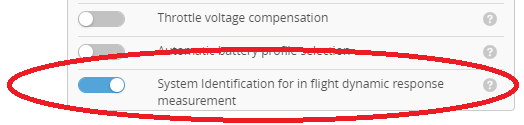
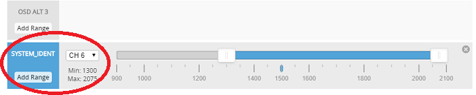
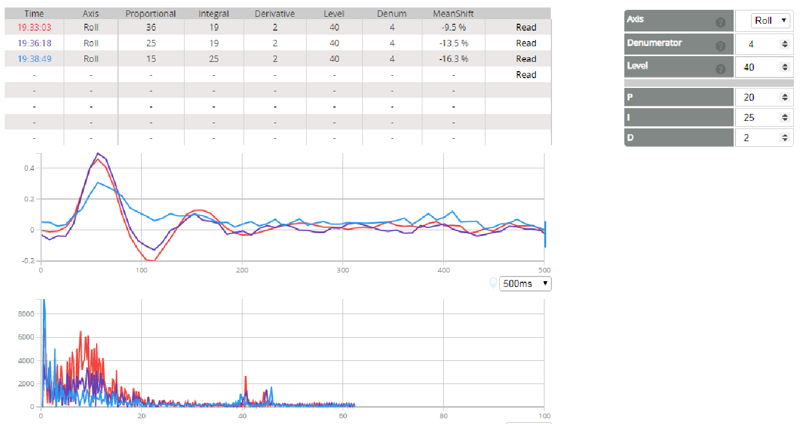
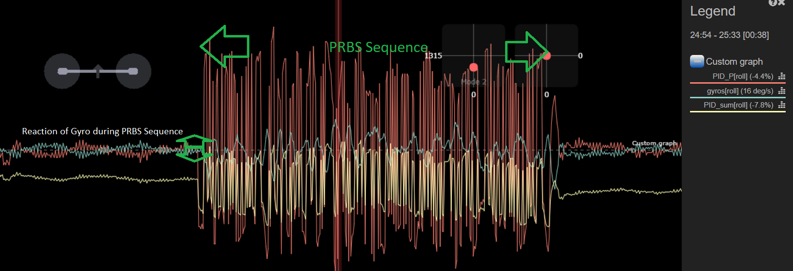

# System Identification

System Identification is a tool to measure the craft dynamic response. It can be used to tune PID parameters. It works for multicopter pid controller.

## How it works

For measuring the dynamic response of the aircraft, a specific PRBS signal is injected in the PID controller feedback loop.
This signal consists of a 'white noise' Pseudo Random Binary Sequence. The aircraft does behave a bit noisy during this seqeunce (typically abvout 1.2 second duration).
As the PRBS signal represents a series of step function in an 'arbitrary' but defined sequence, a cross correlation of the measured response of the sensor with the input stimulus represents the small signal impulse response of the system.

## How to set it up

* The SYSTEM_IDENT feature needs to be enabled for system identification. 

* A switch has to be defined to start a PRBS sequence.

* An axis to test has to be selected
* the order of the stimulus length needs to be set (8 = 255 samples, 9 = 511 samples)
* a signal level for the disturbance need to be provided (typically 5% of axis P factor)

The actual disturbance will take about (looptime / denumerator) * (stimulus length + 65) 
E.g. 1msec looptime with denumerator of 4 at order 8 takes approx 1ms x 4 x 255 ~= 1sec.

## How to start System Identification

When hoovering in a stable position trigger the defined system_ident switch. The sequence will start with  0.5sec delay after trigger to avoid glitches by switch actuation. Try to do no apprupt steering during the BRBS period. Capture will only be valid, if system_ident mode switch 
One sequence can be recorded.
After sequence is finished, PRBS can be re-executed if trigger condition is released for more than 0.5sec. Retriggering will overwrite previous capture.
A running PRBS sequence can be terminated at any time when system_ident mode switch is set back from running position.

## How to look at the data

The captures sequence can be read via Configurator tab.
Note the data read is only allowed in disarmed mode. Aircraft must be grounded with motors disabled to access capture data.

## CLI
 
| Command | scaling  | Description |
|-------------------------------------------|-----------------|-------------------------------|
| `sysid_axis`  |   | select axis for system identification (ROLL, PITCH ro YAW)  |
| `sysid_order` |   |  order of PRBS signal  (8  for 255 samples, 9 for 511 samples)|
| `sysid_denum` |   | denumerator for PRBS execution. Data is recorded every nth loop cycle | 
| `sysid_level` |  (scaling 10 = 1%)| disturbance level relative to P factor of selected axis |

## Internals

The define 'USE_SYSTEM_IDENT' is used to seperate the system identification part of the software.

boxId_e enum is extended by BOXSYSID for definition of mode switch.

## bootlog

The bootlog shows the setup of the PRBS generator:
 
Time Evt            Description  Parameters
...
2865: 25  SYSTEM_IDENTIFICATION  (8, 255)
...

Above example the PRBS is configure in order 8 with 255 samples.
